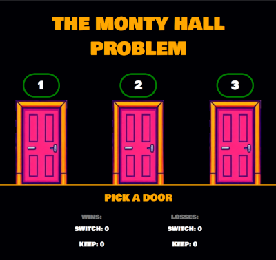

# MONTY HALL PROBLEM

This is an implementation of the classic probability puzzle, the Monty Hall problem. It's a purely client-side game written in JavaScript, HTML, and CSS. The user can play the game repeatedly, and the scores are tallied below the game buttons (as long as they don't refresh the browser).

The puzzle is figuring out whether the user should switch doors or keep doors, or if neither option offers statistical advantages.

There's nothing to install. You can visit the live site (https://montyhall.pattmayne.com/) or download the package and open index.html in any browser.

The fonts used in the game include **Alte Haas Grotesk** fonts (https://www.dafont.com/alte-haas-grotesk.font, https://www.yannlecoroller.com/) and **Bolwby One** (https://www.fontsquirrel.com/fonts/bowlby-one).

The images (doors, donkey, money) are from https://deepai.org.

## SCREENSHOTS

